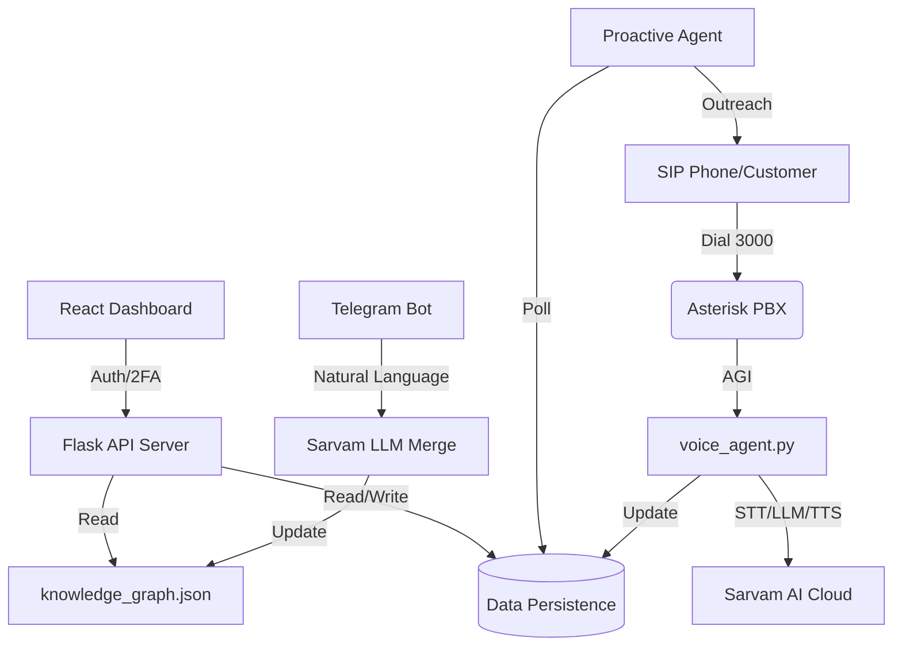

# 🏍️ Ather Intelligence Hub (Deep Dive)

An enterprise-grade, multilingual AI ecosystem for Ather Energy. This suite combines a **Multilingual Voice Agent**, a **Proactive Service Outreach Engine**, and a **Real-time Management Dashboard** to automate sales, service, and customer feedback.


---

## 🎯 Core Capabilities

### 1. Multilingual Voice AI (Inbound)
*   **Customer Calls**: Dial **3000** on any SIP phone (configured via `extensions.conf`).
*   **Cognitive Reasoning**: Uses **Sarvam LLM** (`sarvam-105b`) integrated with a **Knowledge Graph** (`knowledge_graph.json`).
*   **Native Speech**: 
    *   **STT**: `saarika:v2.5` (optimized for Indian accents).
    *   **TTS**: `bulbul:v3` (high-fidelity Indian language synthesis).
*   **Language-Lock Logic**: Prevents language drifting during conversation using strict system prompts.

### 2. Proactive Service Outreach (Outbound)
*   **Autonomous Follow-ups**: The `proactive_agent.py` monitors maintenance schedules.
*   **Lead Recovery**: If a customer is unreachable, the system logs the status and moves them to a "Pending Follow-up" queue.
*   **Status Options**: Not Picking, Not Reachable, Switched Off, or Appointment Scheduled.

### 3. Enterprise Admin Dashboard
*   **Full CRM**: Lead management with source tracking (Voice, Web, etc.).
*   **Service Ops**: Real-time service slot availability across 3 stations (A, B, C).
*   **Security**: TOTP-based 2FA (Google Authenticator) for administrative actions.

---

## 🛠️ Technical Stack Deep-Dive

### Logic Layer (`retail_agent_utils.py`)
*   **Best Agent Allotment**: New leads are automatically assigned to staff members based on their conversion rates.
*   **Autonomous Booking**: Find the first free station among `Station A`, `Station B`, or `Station C` for a given time slot.
*   **Identity Resolution**: Normalizes phone numbers to match calls with existing customer profiles across different modules.
*   **Sentiment Analysis**: Voice interactions are analyzed for sentiment, churn risk, and purchase probability.

### API Reference (`server.py` on Port 8001)
| Endpoint | Method | Description |
|----------|--------|-------------|
| `/api/login` | POST | Initial admin authentication. |
| `/api/verify-2fa` | POST | Verifies 6-digit TOTP code. |
| `/api/leads` | GET | Fetches all sales leads. |
| `/api/service` | GET | Fetches service records & appointments. |
| `/api/calls` | GET | Aggregates all voice call logs. |
| `/api/knowledge` | GET | Returns the current AI brain (JSON). |
| `/api/staff` | GET/POST | Manages AI agents and staff data. |

### Telegram Knowledge Bot (`telegram_bot.py`)
*   **/view**: Displays the current raw Knowledge Graph.
*   **/logs**: Shows the last 5 knowledge update attempts.
*   **Natural Language Updates**: Send messages like *"Ather 450X price is now 1.45 Lakhs"* — the bot uses AI to merge this into the JSON structure without manual editing.

---

## 🏗️ System Architecture



---

## 📁 Database Schema (JSON-based)

### `leads.json`
```json
{
  "id": "8f3a1b2c",
  "customer_name": "John Doe",
  "phone": "9876543210",
  "source": "Voice Call",
  "priority": "High",
  "status": "Interested",
  "assigned_to": "Best Agent Name"
}
```

### `service_records.json`
```json
{
  "id": "S1234",
  "customer_name": "Jane Smith",
  "appointment_date": "2026-05-10",
  "appointment_time": "14:00",
  "station": "Station B",
  "status": "Scheduled"
}
```

---

## 🚀 Deployment & Operation

### Environment Setup
Create a `.env` file with:
```env
SARVAM_API_KEY=your_key
TELEGRAM_BOT_TOKEN=your_token
```

### Unified Startup
```bash
./start.sh
```
This script automates:
1.  **Asterisk Sync**: Moves `.conf` and AGI scripts to system folders.
2.  **Service Launch**: Starts `proactive_agent.py`, `telegram_bot.py`, and `server.py` in the background.
3.  **Logs**: Each service pipes output to `*.log` files in the root directory.

---

## 📄 License
MIT License.

## 👤 Maintainer
**Shivaraj M** - [@shivarajm8234](https://github.com/shivarajm8234)
