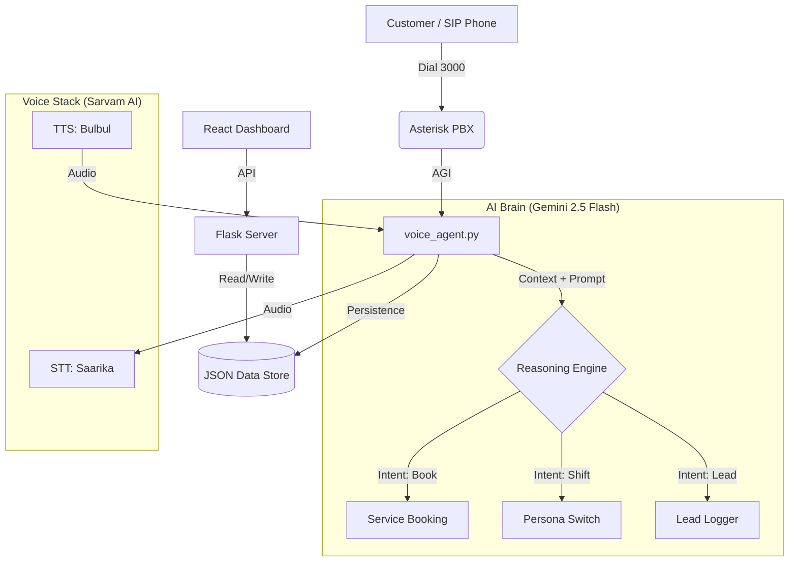

# 🏍️ Ather Intelligence Hub (Deep Dive)

An enterprise-grade, multilingual AI ecosystem for Ather Energy. This suite combines a **Multilingual Voice Agent (Gemini-Powered)**, a **Proactive Service Outreach Engine**, and a **Real-time Management Dashboard** to automate sales, service, and customer feedback with human-like reasoning.


-blue?style=for-the-badge)


---

## 🎯 Core Capabilities

### 1. Multilingual Voice AI (Next-Gen)
*   **Cognitive Engine**: Powered by **Gemini 2.5 Flash** for sub-second reasoning and context-aware responses.
*   **Dynamic Personas**: Automatic persona shifting (e.g., from Sales to Technical Specialist) based on user intent using `[SHIFT_TO:]` logic.
*   **Native Indian Voice Stack**:
    *   **STT**: `saarika:v2.5` (Sarvam AI) - optimized for regional accents and noisy environments.
    *   **TTS**: `bulbul:v3` (Sarvam AI) - high-fidelity, expressive synthesis in English, Kannada, and Hindi.
*   **Multi-Turn Memory**: Maintains user profiles (`users/`) with summaries of previous interactions to provide personalized greetings and relevant status updates.

### 2. Proactive Service Outreach
*   **Autonomous Follow-ups**: `proactive_agent.py` scans maintenance logs and initiates calls to customers with "Due Soon" or "Overdue" service status.
*   **Lead Recovery**: Intelligent logging of unreachable customers (Switched Off, Not Picking) with automated retry scheduling.
*   **Live Dashboard Sync**: All outreach results are reflected instantly on the Admin Dashboard.

### 3. Enterprise Admin Dashboard (`dashboard-new`)
*   **Unified CRM**: Real-time tracking of Hot Leads, Service Appointments, and Customer Feedback.
*   **Persona Control**: Live monitoring of which AI persona is currently active and handling calls.
*   **Security**: Mandatory TOTP-based 2FA for all administrative actions, ensuring data privacy.

---

## 🛠️ Technical Stack Deep-Dive

### Logic Layer (`retail_agent_utils.py`)
*   **Agentic Allotment**: New leads are automatically assigned to staff members with the highest conversion rates using real-time performance metrics.
*   **Autonomous Booking**: Find the first free station among `Station A`, `Station B`, or `Station C` for a given time slot.
*   **Identity Resolution**: Normalizes phone numbers to unify customer profiles across Voice, Web, and Telegram interactions.
*   **Advanced Analytics**: Performs sentiment analysis, churn risk assessment, and purchase probability calculation for every interaction.

### API Reference (`server.py` on Port 8001)
| Endpoint | Method | Description |
|----------|--------|-------------|
| `/api/login` | POST | Initial admin authentication. |
| `/api/verify-2fa` | POST | Verifies 6-digit TOTP code. |
| `/api/leads` | GET | Fetches all sales leads (filtered by status/priority). |
| `/api/service` | GET | Fetches service records & appointment slots. |
| `/api/calls` | GET | Aggregates all voice call logs and AI-generated summaries. |
| `/api/staff` | GET/POST | Manages AI personas and staff performance data. |

### Telegram Knowledge Bot (`telegram_bot.py`)
*   **Natural Language Updates**: Update the showroom's "Brain" by simply chatting. Example: *"Add a 10% discount on the 450 Apex for this weekend."*
*   **Auto-Merge Logic**: Uses Gemini to parse unstructured text and merge it into the structured `knowledge_graph.json`.

---

## 🏗️ System Architecture



---

## 📁 Data Structure

### `staff.json` (Persona Definitions)
```json
{
  "name": "Kavi",
  "role": "Technical Specialist",
  "voice_gender": "Male",
  "instructions": "Focus on battery health and technical specs.",
  "conversion_rate": 0.85
}
```

### `feedback.json` (AI-Analyzed)
```json
{
  "customer_name": "Ramesh",
  "sentiment": "Positive",
  "churn_risk": "Low",
  "rating": 5,
  "recommendation": "Incentivize for referral"
}
```

---

## 🚀 Deployment

### Environment Configuration
Create a `.env` file in the root directory:
```env
GEMINI_API_KEY=your_google_ai_key
SARVAM_API_KEY=your_sarvam_key
TELEGRAM_BOT_TOKEN=your_bot_token
```

### Quick Start
```bash
./start.sh
```
This script handles Asterisk configuration sync, dependency verification, and multi-service background launch.

---

## 📄 License
MIT License.

## 👤 Maintainer
**Shivaraj M** - [@shivarajm8234](https://github.com/shivarajm8234)
